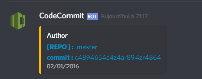

# codecommit-discord-notifier

> A simple Lambda that push notifications following a CodeCommit trigger

## How to try localy

```shell
git@github.com:V-Nico/codecommit-discord-notifier.git
cd codecommit-discord-notifier
```

In the index.js file modify the line `"customData": "your/webhook"` with your webhook url

```shell
node src/index.js
```

## How to use with AWS Lambda

1. Create your lambda function and give it an IAM role that can use codecommit

2. Download the zip of [lambda branch](https://github.com/V-Nico/codecommit-discord-notifier/tree/lambda)

3. Import the zip in your lambda

4. Add a CodeCommit trigger, fill in the form, in the "custom data" field enter the url of your webhook and save

5. Go to your repository settings, select your new trigger and test it

To use it with several repositories you just have to repeat the step 4

## Customize

The discord message looks like this



You can easily customize it, read [the discord webhooks guide](https://birdie0.github.io/discord-webhooks-guide/) and modify the config file.